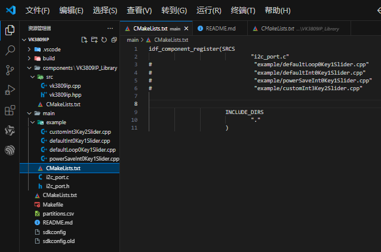
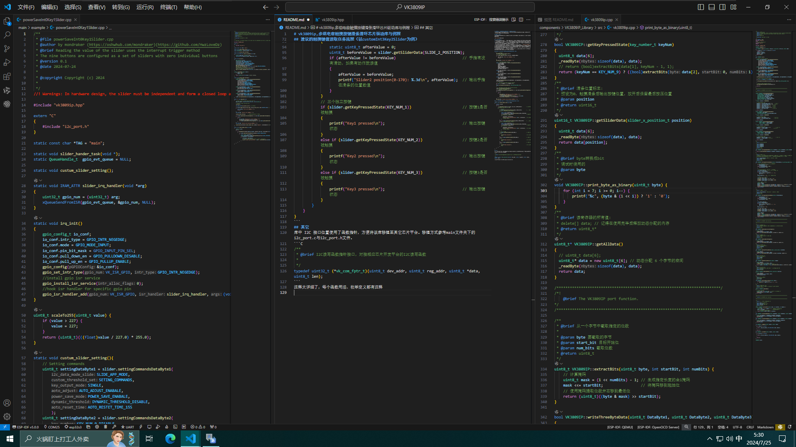

# vk3809ip&tty6953
## 多组电容触摸按键滑条滑环芯片驱动库与例程
>警告：在硬件设计时，滑条滑环必须独立且首尾闭环才可以读取到正确的值。因为按键具有自学习属性，如果相互交叉干扰会导致值大幅度跳变。

## 如何使用例程
在main文件夹下的CMakeLists.txt文件中禁用或启用例程即可。一次只能取消注释一个例程，否则会如你所愿的报错。



## 每个例程的作用
* defaultLoop0Key1Slider    ：最基础的示例，使用了库中默认的初始化参数，将芯片9个按键全部配置为一个滑条。未使用中断引脚，使用简单的循环判断。当滑条被触摸时，串口输出滑条被触摸的位置。
* defaultInt0Key1Slider     ：与上一个示例不同的是使用了中断引脚判断触摸状态，并且在中断函数中监控引脚状态。配合freertos任务读取滑条位置。优点是不需要一直占用I2C总线读取触摸状态，且不需要一直占用循环任务，并且不需要将函数跑在中断里。
* powerSaveInt0Key1Slider   ：与上一个示例不同的是自定义启用了位于 `Setting commands` 寄存器中Byte1-bit3的PSM省电模式。覆盖了库中初始化的相关设置。无按键4秒后进入睡眠模式，静态电流为：6.8uA@3.0V。触摸后回到工作模式，工作电流：1.1mA@3.0V（如果设置为省电模式则读取寄存器前必须先读取中断引脚状态或者触摸状态，否则建议每次等待30ms之后读取，也就是回到工作模式的时间），可以与上一个示例对比试验出电流的消耗，还是比较明显的。
* customInt3Key2Slider      ：与上一个示例不同的是，使用了自定义的初始化流程，覆盖了库中的9按键滑条默认设置。芯片可以完全被用户自定义！！！

## 自定义基本初始化流程（以customInt3Key2Slider为例）
```C
    // 1. 初始化I2C
    ESP_ERROR_CHECK(i2c_master_init()); 
    // 2. 初始化芯片默认配置
    if (slider.begin(twi_read, twi_write, VK3809IP_ADDR))
    {
        ESP_LOGE(TAG, "Error init vk3809ip !!!");
        for(;;)
            ;
    }
    ESP_LOGI(TAG, "Success init vk3809ip !!!");

    // 3. 自定义设置 setting commands
    uint8_t settingDataByte1 = slider.settingCommandsDataByte1(
        SLIDE_APP_MODE,
        SETING_COMMANDS,
        SINGLE,
        AUTO_ADJUST_ENABALE,
        POWER_SAVE_ENABALE,
        DYNAMIC_THRESHOLD_DISABLE,
        AOTO_RESTET_TIME_15S
        );
    uint8_t settingDataByte2 = slider.settingCommandsDataByte2(
        KEY_NUM_3,
        KEY_ACK_TIME_4
        );
    uint8_t settingDataByte3 = slider.settingCommandsDataByte3(
        SLIDE_X_NUM_3,
        SLIDE_X_NUM_3
        );
    uint8_t settingDataByte4 = slider.settingCommandsDataByte4(
        KEY_OFF_NUM_1_DISABLE,
        SLIDE_X_NUM_DISABLE
        );
    slider.settingCommandsData(settingDataByte1, settingDataByte2, settingDataByte3, settingDataByte4);

    // 4. (可选默认)自定义设置 threshold commands
    for (int i = TP_NUM_0; i <= TP_NUM_9; i++)
    {
    slider.settingTpxThresholdData(16, (tpx_setting_number_t)i);
    }

    // 5. (可选默认)自定义设置 sleep threshold Setting
    slider.settingSleepThresholdData(2);
    // 6. 系统校正标志与系统写标志
    if ((slider.getSystemCorrectionFlagState() == 1 && slider.getSystemWriteFlagState() != 1) == 0)
    {
        for(;;)
        {
            ESP_LOGE(TAG, "Waitting for config vk3809ip !!!");
            vTaskDelay(pdMS_TO_TICKS(50));
            if ((slider.getSystemCorrectionFlagState() == 1 && slider.getSystemWriteFlagState() != 1) == 1){break;}
        }
    }
    ESP_LOGI(TAG, "Success write setting vk3809ip !!!");
```
## 建议的触摸键值读取任务流程（以customInt3Key2Slider为例）
```C
static void slider_hander_task(void *args)
{
    uint32_t io_num;
    for(;;) 
    {
        if (xQueueReceive(gpio_evt_queue, &io_num, portMAX_DELAY))          // 当有触摸状态变化时，INT脚会拉Low 100ms
        {
            // 两组滑条
            if (slider.getSliderPressedState(SLIDE_1_TOUCH_STATE))          // 第一组滑条是否是被触摸的状态，如果被触摸则执行
            {
                static uint8_t afterValue = 0;
                uint8_t beforeValue = slider.getSliderData(SLIDE_1_POSITION);
                if (afterValue != beforeValue)                              // 手指有没有滑动，如果有动作就读值
                {
                    afterValue = beforeValue;
                    printf("Slider1 position(0-170): %.3d\n", afterValue);  // 输出手指在滑条的位置数值
                }
            }
            else if (slider.getSliderPressedState(SLIDE_2_TOUCH_STATE))     // 第二组滑条是否是被触摸的状态，如果被触摸则执行
            {
                static uint8_t afterValue = 0;
                uint8_t beforeValue = slider.getSliderData(SLIDE_2_POSITION);
                if (afterValue != beforeValue)                              // 手指有没有滑动，如果有动作就读值
                {
                    afterValue = beforeValue;
                    printf("Slider2 position(0-170): %.3d\n", afterValue);  // 输出手指在滑条的位置数值
                }
            }
            // 三个独立按键
            if (slider.getKeyPressedState(KEY_NUM_1))                       // 按键1是否被触摸
            {
                printf("Key1 pressed\n");                                   // 输出按键状态
            }
            else if (slider.getKeyPressedState(KEY_NUM_2))                  // 按键2是否被触摸
            {
                printf("Key2 pressed\n");                                   // 输出按键状态
            }
            else if (slider.getKeyPressedState(KEY_NUM_3))                  // 按键3是否被触摸
            {
                printf("Key3 pressed\n");                                   // 输出按键状态
            }
        }
    }
}
```
## 其它
库中 I2C 接口位置使用了函数指针，方便将该库移植至其它芯片平台。移植方式参考main文件夹下的i2c_port.c与i2c_port.h文件
```C
/**
 * @brief I2C读写函数指针接口，对接相应芯片开发平台的I2C读写函数
 * 
 */
typedef uint32_t (*vk_com_fptr_t)(uint8_t dev_addr, uint8_t reg_addr, uint8_t *data, uint8_t len);
```
注释非常详细了，每个函数用法、枚举定义等等都有注释了，有问题来q群 `735791683` 里反馈吧


